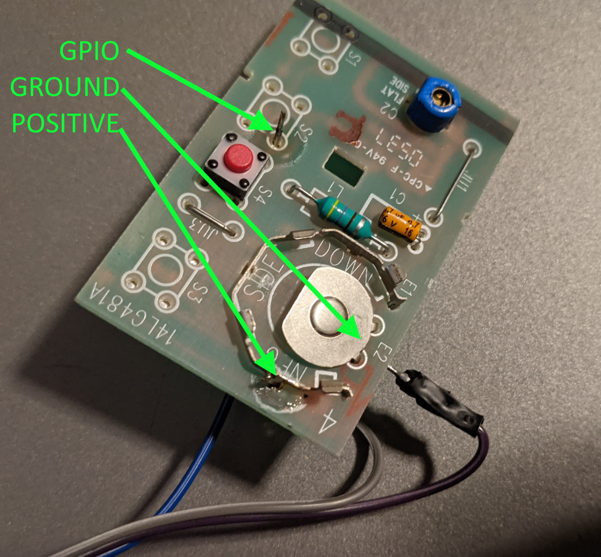

# Raspberry PI Garage Door Remote
## Why
Most Raspberry PI Garage Door remote control solutions are complicated and sometimes costly. Here is a simple, low cost alternative.


## How
1. Getting Ready
    * Find a garage door remote that runs on a 3.3v battery. I used a 371LM Liftmaster Remote Control.
    * Program it to your garage door if it isn't already.
    * Remove the PCB from the plastic case and remove the battery.
2. Powering It Up
    * Solder wires to the positive and negative (ground) battery connections.
    * Connect the positive and ground wires to your Raspberry PI. I used PIN 1 (3.3V power) and PIN 6 (Ground)
    * Test your connections by pressing the button on the garage door remote. It should... work.
3. Pressing Buttons
    * Solder a wire to the PCB that will simulate a button press.
    * Connect the button pressing wire to a GPIO on your Raspeberry PI. I used pin 40 (GPIO 21) because it defaults to normally open.
4. Remote Control Web API
    * Compile and run the golang garage-door-remote program. If you used a different wiring scheme than I did, please be sure to change the code!
    * Visit http://raspberrypi:8081/ to press your garage door button programatically.
5. Tasker
    * Put a NFC sticker inside your garage door keypad
    * Program Tasker to recogonize this sticker and GET http://raspberrypi:8081/.
    * Enjoy being able to tap your phone to your garage door keypad and watch as the door opens... instantly.

## Building 
```
go get
go build

./garage-door-remote &
```

## Pictures

